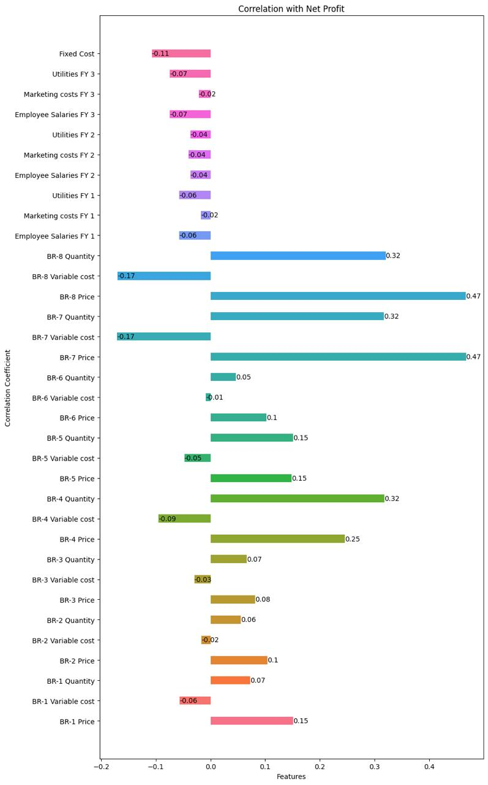
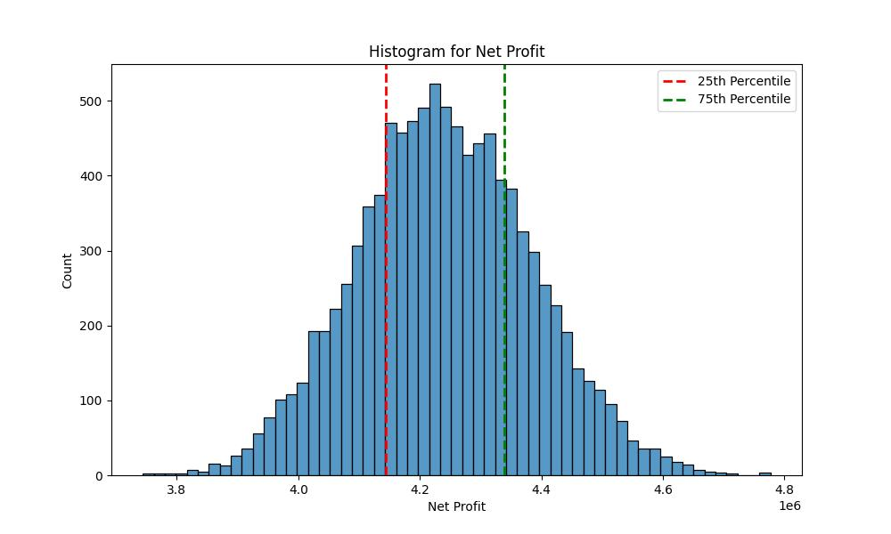
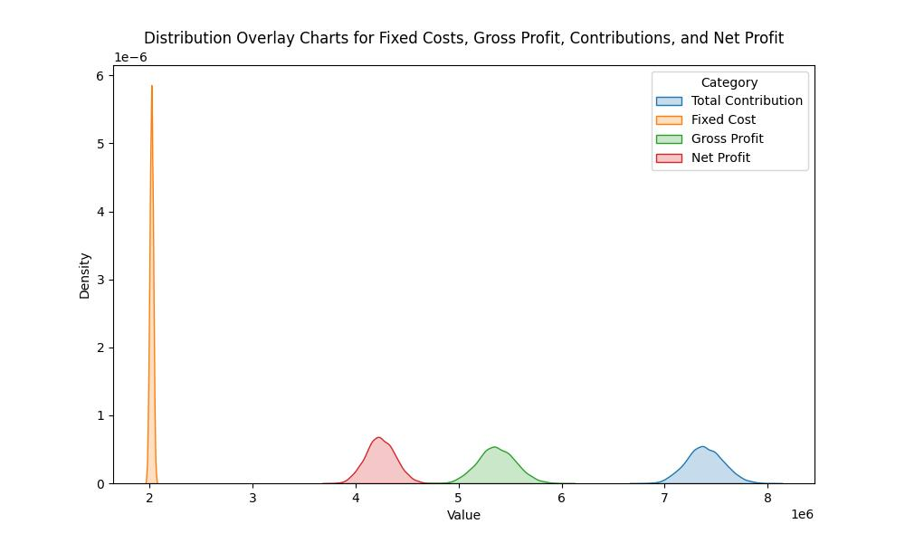
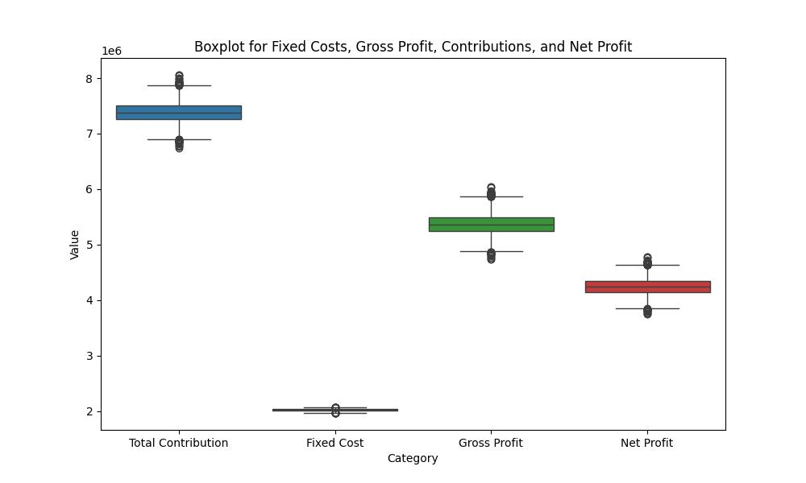
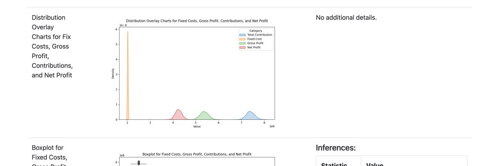
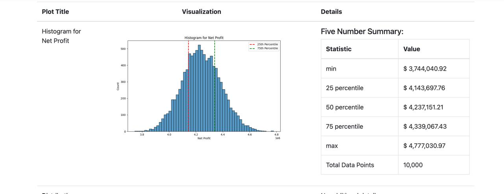

# 🍺 Craft Beer Business Simulation  

A data-driven business simulation project completed for **AD715: Quantitative & Qualitative Decision-Making** at Boston University (Spring 2025).  
Our team designed a **craft beer bar and microbrewery in Austin, Texas**, running multiple simulation cycles to optimize **operations, finance, HR, and innovation strategies**.  

The result? A microbrewery concept that *breaks even in just 9 months* and pours $4.3M median profit over 36 months.  

---

## 📊 Project Highlights
- Simulated business decisions for **production, innovation, HR, and financial strategy**.  
- Conducted **PESTLE, SWOT, and break-even analyses**.  
- Used **what-if analysis, forecasting, and optimization** to drive decision-making.  
- Best-performing simulation cycle achieved:  
  - **Median Net Profit:** $4.32M  
  - **Break-even:** 9.08 months  
  - **Contribution Margin:** $5.6M  

---

## 🖼️ Visuals  

  

  

  

  

  

  

---

## 🎬 Animation Idea
If you want to make this repo more dynamic:  
1. Export your graphs as PNGs or JPEGs.  
2. Use a free tool like [ezgif.com](https://ezgif.com) or [loading.io](https://loading.io) to create GIFs or SVG animations.  
3. Replace the static image links above with your animated versions.  

Example:  
```markdown

