<div align="center">


### 🎯 **A data-driven business simulation project**
**AD715: Quantitative & Qualitative Decision-Making**  
**Boston University • Spring 2025**

</div>

## 🚀 Executive Summary

<div align="center">

```
┌─────────────────────────────────────────────────────────────────┐
│  🚀 SIMULATION RESULTS                                          │
├─────────────────────────────────────────────────────────────────┤
│  ⚡ Break-Even Timeline    │  💰 Median Net Profit              │
│     9.08 months            │     $4.32M                          │
├─────────────────────────────────────────────────────────────────┤
│  📊 Contribution Margin   │  📅 Simulation Period               │
│     $5.6M                  │     36 months                       │
└─────────────────────────────────────────────────────────────────┘
```

<table>
<tr>
<td align="center"></td>
<td align="center"></td>
</tr>
<tr>
<td align="center"></td>
<td align="center"></td>
</tr>
</table>
</div>

Our team designed a **craft beer bar and microbrewery in Austin, Texas** 🌆, running multiple simulation cycles to optimize **operations, finance, HR, and innovation strategies**. 

> **The result?** A microbrewery concept that ***breaks even in just 9 months*** and pours **$4.3M median profit** over 36 months! 🎯

---

## 📊 Project Highlights

<details>
<summary><b>🎯 Strategic Business Simulation</b></summary>

- Simulated comprehensive business decisions for **production, innovation, HR, and financial strategy**
- Multiple simulation cycles with varying parameters
- Real-world business constraints and market conditions
- Austin-specific market analysis and positioning

</details>

<details>
<summary><b>📈 Advanced Analytics Framework</b></summary>

- **PESTLE Analysis** - Political, Economic, Social, Technological, Legal, Environmental factors
- **SWOT Analysis** - Strengths, Weaknesses, Opportunities, Threats assessment  
- **Break-even Analysis** - Financial viability and timeline projections
- **Sensitivity Analysis** - Risk assessment and scenario planning

</details>

<details>
<summary><b>🔮 Quantitative Decision Tools</b></summary>

- **What-if Analysis** - Multiple scenario testing
- **Financial Forecasting** - 36-month revenue and profit projections  
- **Optimization Models** - Resource allocation and efficiency maximization
- **Monte Carlo Simulations** - Risk modeling and probability distributions

</details>

<details>
<summary><b>🏆 Best-in-Class Performance</b></summary>

- **Fastest Break-even**: 9.08 months (industry average: 18-24 months)
- **High Profitability**: $4.32M median net profit over 3 years
- **Strong Margins**: $5.6M contribution margin
- **Scalable Model**: Proven growth trajectory and market penetration

</details>

---

## 🎨 Simulation Visualizations

<div align="center">

### 📈 Financial Performance Dashboard

*Monthly revenue progression showing seasonal trends and growth trajectory*

### 💰 Profitability Analysis  

*Break-even timeline and profit margin evolution over 36 months*

### 📊 Market Penetration Metrics

*Customer acquisition and market share growth in Austin craft beer scene*

### 🎯 Operational KPIs

*Key performance indicators tracking efficiency and strategic goals*

### 🔄 Scenario Comparison

*Comparative analysis of different strategic approaches and outcomes*

### ⚠️ Risk Assessment Matrix
  
*Sensitivity testing and risk factors across various market conditions*

</div>

---

## 🛠️ Methodology & Tools

<div align="center">
<table>
<tr>
<td></td>
<td></td>
<td></td>
</tr>
<tr>
<td></td>
<td></td>
<td></td>
</tr>
</table>
</div>

### 📋 Analysis Framework:
- **Financial Modeling**: DCF, NPV, IRR calculations
- **Market Research**: Austin craft beer industry analysis  
- **Operational Planning**: Production capacity and scaling models
- **Risk Management**: Probability distributions and scenario planning
- **Optimization**: Linear programming for resource allocation

---

## 🏢 Business Model Canvas

```mermaid
graph TD
    A[🍺 Craft Beer Production] --> B[🏪 Taproom Experience]
    A --> C[📦 Distribution Network]
    B --> D[💰 Revenue Streams]
    C --> D
    D --> E[📈 $4.32M Net Profit]
    
    F[👥 Target Market] --> B
    G[🤝 Key Partnerships] --> A
    H[⚡ Key Activities] --> A
    H --> B
    
    style E fill:#4FD1C7,stroke:#38D9A9,stroke-width:4px,color:#000
    style A fill:#8B5CF6,stroke:#7C3AED,stroke-width:2px
    style B fill:#F59E0B,stroke:#D97706,stroke-width:2px
    style C fill:#EF4444,stroke:#DC2626,stroke-width:2px
    style D fill:#38D9A9,stroke:#10B981,stroke-width:2px
```

<div align="center">



</div>

---

## 🎓 Academic Context

**Course**: AD715 - Quantitative & Qualitative Decision-Making  
**Institution**: Boston University Questrom School of Business  
**Semester**: Spring 2025  
**Team Project**: Multi-disciplinary business simulation  

### 📚 Learning Objectives Achieved:
- [x] Applied quantitative decision-making frameworks
- [x] Integrated qualitative market insights with data analysis  
- [x] Demonstrated financial modeling proficiency
- [x] Executed comprehensive business strategy simulation
- [x] Presented data-driven recommendations to stakeholders

---

## 🎉 Key Success Metrics

<div align="center">

| Metric | Target | Achieved | Status |
|--------|--------|----------|--------|
| Break-even Timeline | <18 months | **9.08 months** | ✅ **Exceeded** |
| 3-Year Net Profit | >$2M | **$4.32M** | ✅ **Exceeded** |
| Contribution Margin | >$3M | **$5.6M** | ✅ **Exceeded** |
| Market Penetration | 5% | **8.3%** | ✅ **Exceeded** |
| Customer Satisfaction | 4.0/5 | **4.6/5** | ✅ **Exceeded** |

</div>

---

## 🔮 Future Implications

<div align="center">

**📈 Scalability Potential**  
*Model demonstrates viability for expansion to other Texas markets*

**🤖 Technology Integration**  
*Framework adaptable for AI-driven demand forecasting*

**🌱 Sustainability Focus**  
*ESG metrics integration for modern business requirements*

</div>

---

<div align="center">

### 🍻 **Cheers to Data-Driven Innovation!** 🍻


---

*"In beer there is wisdom, in data there is profit!"* 🍺📊

[](https://github.com/yourusername)
[](https://www.bu.edu/)

</div>
